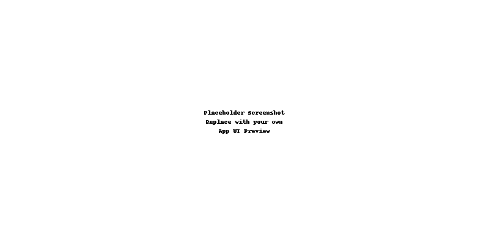

# Weekly Meal Planner & Shopping List Generator

Un mic web-tool static care te ajută să îți planifici mesele pentru o săptămână și să generezi automat lista de cumpărături, totul din browser – fără backend și fără instalare!



## 🔎 Caracteristici

- **Planificare săptămânală** (prânz și cină, Luni–Duminică)  
- **Generare PDF** instant cu:  
  - Tabelul de mese  
  - Lista de cumpărături unificată şi grupată  
- **Plătește & Descarcă** direct din interfață, cu Stripe Checkout integrat  
- 100% client-side (HTML / JS / jsPDF), găzduire gratuită pe GitHub Pages  

## 🚀 Demo Live

https://<username>.github.io/weekly-meal-planner/

## 🛠️ Cum se folosește

1. Clonează acest repo:
   ```bash
   git clone https://github.com/<username>/weekly-meal-planner.git
